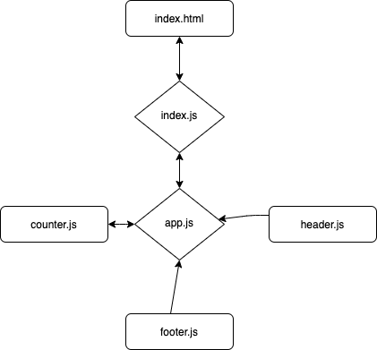

# LAB - Class 22

## React Testing

### Author: Randee Orion

### Links and Resources

- [submission PR](https://github.com/randee-401-advanced-javascript/lab22/pull/1)
- [ci/cd](http://xyz.com) (GitHub Actions)
- [front-end application](http://xyz.com) (when applicable)

### Setup

#### How to initialize/run your application (where applicable)

- e.g. `npm start`

#### Tests

- How do you run tests?
- Any tests of note?
- Describe any tests that you did not complete, skipped, etc

#### UML

